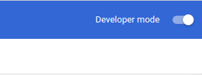
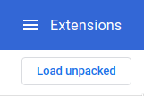
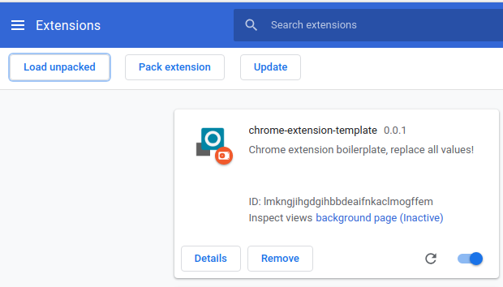

# chrome-extension-template

## Introduction

collect-hackernews

## Installation

Clone the repo:

```
git clone git@github.com:edrpls/chrome-extension-template.git name-of-your-project
```

Set git to track your own repository instead of this one:

```
git remote set-url --delete origin git@github.com:edrpls/chrome-extension-template.git # Remove old origin
git remote set-url --add origin [YOUR REPO URL] # Add new origin
```

Install dependencies:

```
yarn install # or npm install
```

## Usage

To run a development server that will watch for file changes and rebuild the scripts, run:

```
yarn start
```

To just build the files without the development server:

```
yarn build
```

Both commands will create a `dist/` directory, it will contain the built files that should be loaded into the browser or packed.

## Load into Chrome

To load the built files into Chrome, open [chrome://extensions/](chrome://extensions/).

Enable "Developer mode" if it's not enabled yet:



Click on "Load unpacked":



Find the `dist/` directory on your system and open it.

The extension should be now at the top of the page:

